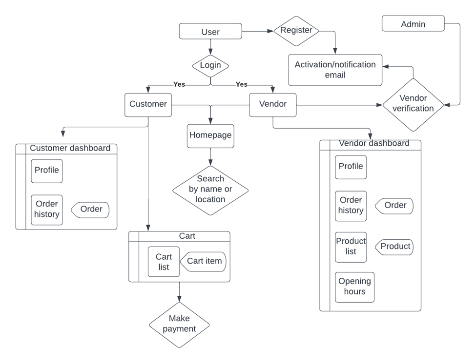
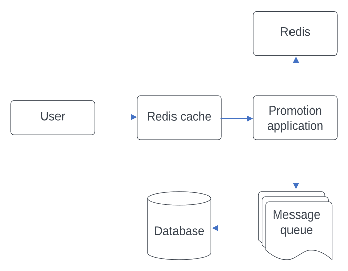
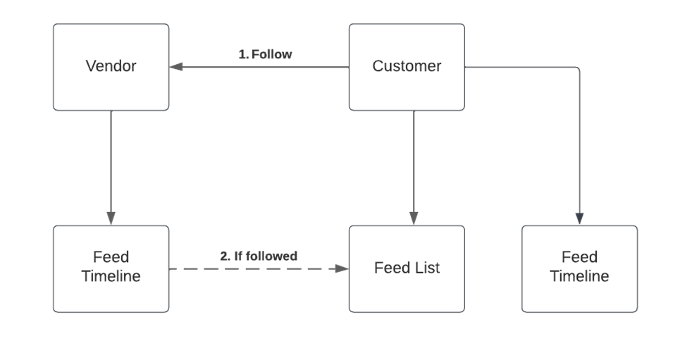
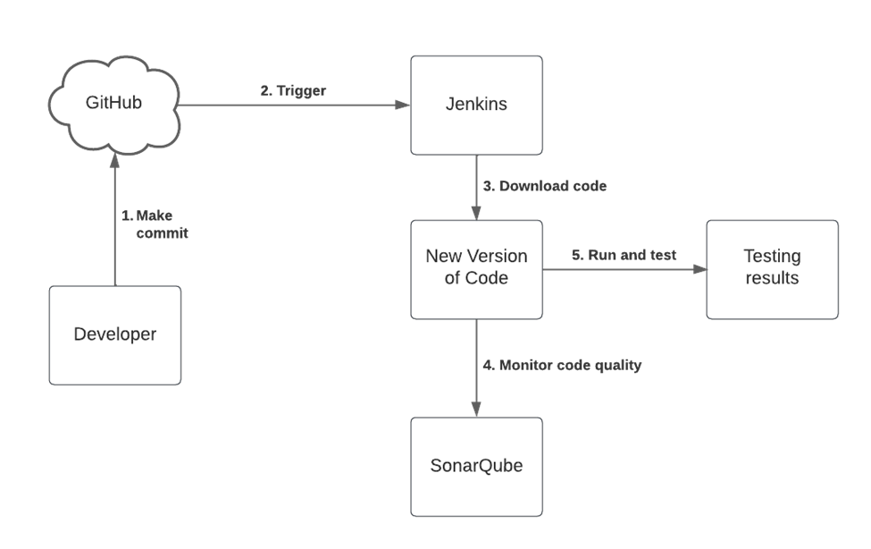

# Project Design

The mains roles for the online shopping system are customer, vendor and administrator. The functionalities can be divided by different roles, as shown in Figure 1.

---
_Figure 1 Flowchart of the online shopping system._

Redis and Kafka are required to handle the high concurrency situation. The promotion quantity is added to the cache. To protect the database, message queue is sandwiched between database and the application. The design for flash sale module is shown in Figure 2.

---
_Figure 2 Architecture for flash sale service._

Each customer and vendor have a social media profile. Users can publish new posts, as well as see others. If a customer is interested in one post, he / she can visit the pages of post and the vendor owning it. The connection will be built if the customer follows the vendor. Figure 3 shows the working flow of social media module.

---
_Figure 3 Architecture design of post sharing module._

As shown in Figure 4, when new commit is made to the project on GitHub, Jenkins is triggered automatically. The code will be downloaded and run. The testing results will be updated, as well as the code quality assessment.

---
_Figure 4 Working flow of continuous integration (CI) using Jenkins._
